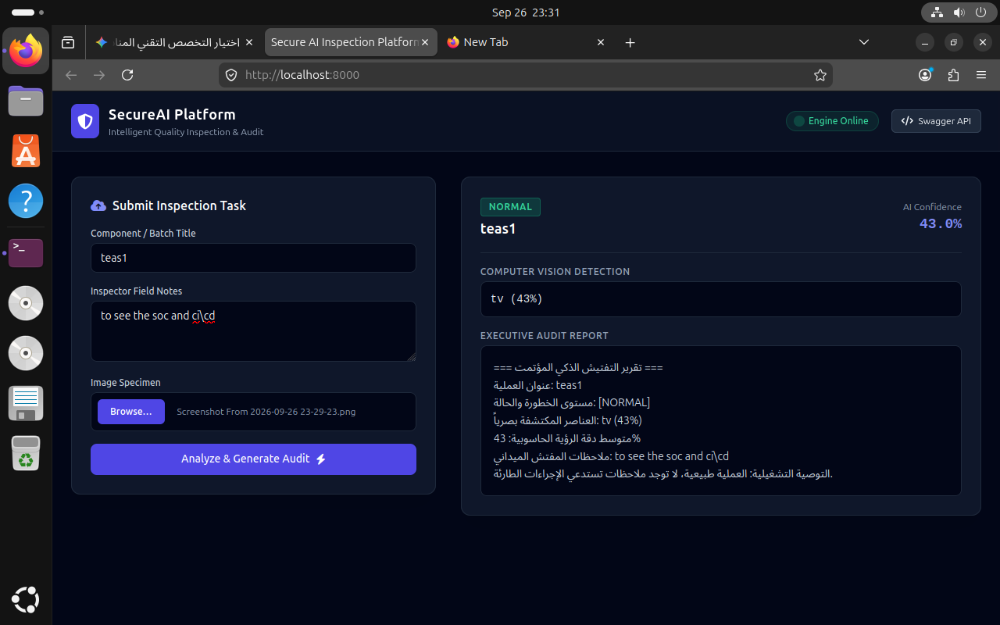
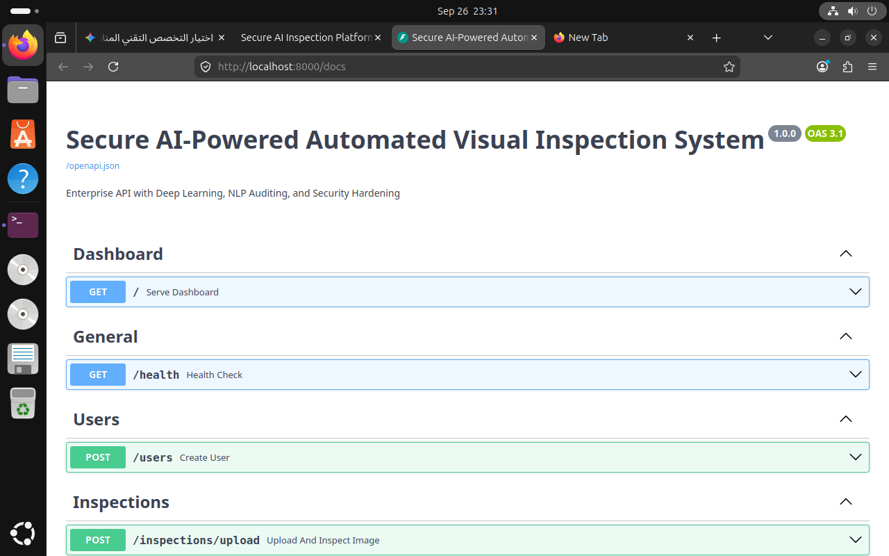

# 🛡️ SecureAI: Automated Visual Inspection & Auditing Platform

[](https://www.docker.com/)
[](https://ubuntu.com/)
[](https://fastapi.tiangolo.com/)
[](https://www.python.org/)
[](https://ultralytics.com)
[](#-security--devsecops-hardening)

A production-grade, containerized automated visual inspection platform integrating a **Deep Learning Vision Engine (YOLOv8)** with an **Automated NLP Audit Reporting Pipeline**. Engineered with **DevSecOps best practices**, fully containerized using **Docker on Linux**, and served through an enterprise **Modern Dark Dashboard**.

---## 📸 Platform Showcase

| Real-time AI Inspection & NLP Audit | Interactive Swagger / OpenAPI Specification |
|:---:|:---:|
|  |  |*Enterprise Tailwind CSS dashboard rendering live Computer Vision detection telemetry, automated Arabic audit summaries, and operational severity grading.*

---## 🏛️ System Architecture

The following diagram illustrates the complete data lifecycle, request flow, and security validation layers:```mermaid
graph TD
    Client([Client / Inspector UI]) -->|HTTP / Form Data| Gateway[FastAPI Application Gateway]
    
    subgraph DevSecOps Layer
        Gateway --> Validation[File Sanitization & Size Check]
        Validation -->|Check Extension & Limit to 10MB| AuthEngine[Auth & Security Module]
        AuthEngine -->|PBKDF2 Salted Hashing| Storage[(Database Storage)]
    end
    
    subgraph Core AI Pipeline
        Validation -->|Validated Image Stream| Vision[YOLOv8 Deep Learning Detector]
        Vision -->|Bounding Boxes & Conf Scores| NLP[NLP Rule & Audit Engine]
        NLP -->|Dynamic Risk Classification| Audit[Audit Report Generator]
    end
    
    subgraph Persistence & Response
        Audit -->|Persist Audit Record| Storage
        Audit -->|JSON Telemetry| Gateway
        Gateway -->|Real-Time Dashboard Update| Client
    end
⚡ Key Technical Highlights
1. 🧠 Dual-Core AI Pipeline
Computer Vision (YOLOv8n + OpenCV): Deep learning inference optimized for zero-defect quality inspection. Detects objects, anomalies, and structural defects with granular confidence scoring.

NLP & Automated Audit Logic: Synthesizes inspector field notes and computer vision findings into an executive audit report in Arabic with automated risk classification (CRITICAL, HIGH, MEDIUM, NORMAL).

2. 🛡️ Security & DevSecOps Hardening
Input Sanitization & Buffer Defense: Strict file type validation (.jpg, .png, .webp) and buffer length restrictions (10 MB threshold) preventing denial-of-service (DoS) and binary payload injection.

Cryptographic Protection: Salted PBKDF2-HMAC-SHA256 password hashing (100,000 rounds) mitigating rainbow-table and brute-force vectors.

Decoupled Architecture: Stateless API backend ready for reverse-proxy integration (NGINX/Traefik) and automated CI/CD deployment pipelines.

3. ☁️ Cloud & Container Infrastructure
Containerized Deployment: Multi-layer Dockerfile running on Debian slim with native system graphics libraries (libgl1, libxcb1, libglib2.0).

Environment Isolation: Zero reliance on host-level Python runtimes; reproducible across any Linux Cloud instance (AWS EC2, GCP Compute, Azure VM).

📂 Project Structure
Bash

secure_inspection_platform/
├── app/
│   ├── templates/
│   │   └── index.html          # Modern Dark Dashboard (Tailwind CSS)
│   ├── ai_engine.py            # Computer Vision YOLOv8 Core
│   ├── nlp_engine.py           # NLP Audit Report & Severity Engine
│   ├── security.py             # DevSecOps: Sanitization, Hashing, Auth
│   ├── database.py             # SQLAlchemy Session & Engine Configuration
│   ├── models.py               # Database Entities & ORM Definitions
│   ├── schemas.py              # Pydantic Input/Output Contract Schemas
│   ├── routes.py               # REST API Endpoints & Request Handlers
│   └── main.py                 # FastAPI Application Factory
├── docs/
│   └── assets/                 # Architecture diagrams and UI screenshots
├── Dockerfile                  # Production container definition file
├── requirements.txt            # System dependencies
└── README.md                   # Enterprise documentation
🚀 Quickstart & Deployment
Prerequisites
Docker Engine installed on Linux / macOS / Windows with WSL2.

1. Clone & Navigate
Bash

git clone [https://github.com/Anas-sami/0.git](https://github.com/Anas-sami/0.git)cd 0
2. Build & Launch via Docker
Bash

# Build the production container image
docker build -t secure-ai-inspection:v1 .# Run container on isolated port 8000
docker run -d -p 8000:8000 --name inspection_service secure-ai-inspection:v1
3. Verify System Health
Executive Dashboard: http://localhost:8000

Swagger API Specs: http://localhost:8000/docs

Healthcheck Probe: http://localhost:8000/health

📊 API Specification Reference
MethodEndpointDescriptionSecurity / ScopeGET/Serves the Modern Dark Executive UIPublicGET/healthSystem health check & container statusPublicPOST/usersRegisters a new user with PBKDF2 hashingSanitized InputPOST/inspections/uploadMultipart upload for YOLOv8 & NLP processingFile-Checked & ValidatedGET/inspectionsQueries historic inspection recordsAudit Database
👨‍💻 Author & Engineering
Architected and engineered by Anas Sami Al-Harthi (@Anas-sami).

Designed with a focus on Cloud Infrastructure, Computer Vision integration, and DevSecOps engineering for scalable industrial quality assurance and automated compliance pipelines.
